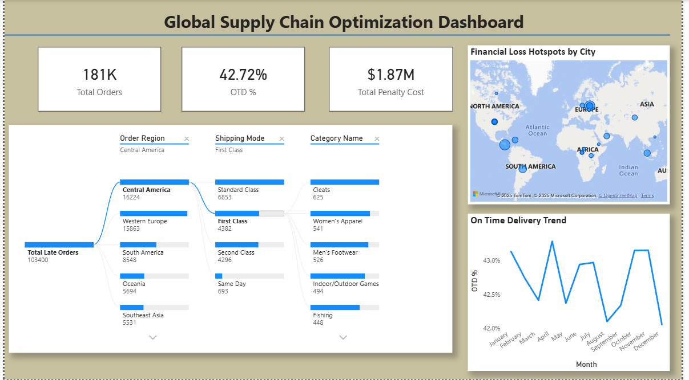

# 🚛 Supply Chain optimisation dashboard

## 📌 Project Overview
An end-to-end analytics project analyzing **180,000+ logistics records** to improve On-Time Delivery (OTD) rates and reduce financial penalties.

**Key Outcome:** Identified a potential **15% cost reduction** by pinpointing shipping bottlenecks in Western Europe using Python, SQL, and Power BI.

## 🛠️ Tech Stack
* **Python:** Data cleaning & Engineering "Penalty Cost" logic (Pandas/SQLAlchemy).
* **MySQL:** Root cause analysis using Window Functions & CTEs.
* **Power BI:** Interactive dashboard with Decomposition Trees & Drill-throughs.

## 🔍 Key Insights & Features
* **Financial Impact:** Calculated financial loss per late order ($10 base + $5/day penalty).
* **Root Cause:** Identified 'Standard Class' shipping as the primary cause of delays in the Western Region.
* **Metric Tracking:** Built dynamic DAX measures to track OTD% against a 95% target.

## 📂 Files Included
* `data_cleaning.py` - Python script for ETL and cost calculation.
* `analysis_queries.sql` - Advanced SQL queries (Rankings, Trends).
* `supply_chain_dashboard.pbix` - The Power BI file.

---

